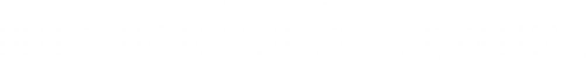
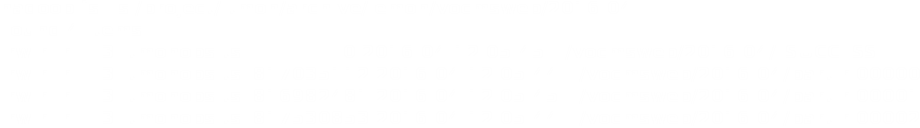

AWG meeting
===========
13 April 2016

## Discussion
Flume HDFS output data formats and aggregation policies

!

## Architecture
* Flume `agents` emitting log lines (JSON)
* Flume `sinks` collecting data and writing in *tmp* folders
* Daily (monthly) aggregations to delete duplicates and to consolidate logs in ~1GB files
* Monthly output folders

!

## HDFS view

For each dataset:

!

One month example

!

## Record description

Each line is a JSON containing:

!

# My experience

- Consumer only
- Daily running jobs to convert JSON in Parquet or other formats

!

## Issues

1) No incremental updates

2) High arrival latency

Solution => to delete current converted month folder and to re-convert it again (daily)

!

## Issues

3) Presence of datasets not compliant with Flume JSON schema

Solution => ad-hoc implementations for each of them

!

## Issues

4) Encoded JSON within `body` value

Solution => parsing twice

!

## Possible improvements

- Textual output file formats are OK but more prone to generate errors
- Force users to define a schema for their body content
- Avoid using strings for numeric values
- Leave duplicates detection to consumers
